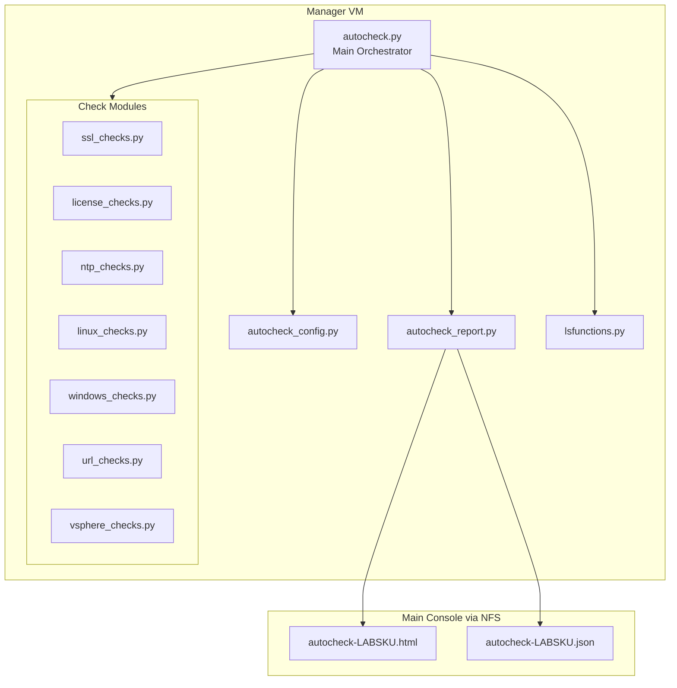

# HOLFY27-MGR-AUTOCHECK

**Version 1.0 - February 2026**
**Author - HOL Core Team**

Automated lab validation tool for HOLFY27 Hands-on Labs. AutoCheck performs comprehensive validation of lab configuration to ensure it meets HOL standards before deployment.

---

## Table of Contents

- [Overview](#overview)
- [Features](#features)
- [Architecture](#architecture)
- [Installation](#installation)
- [Usage](#usage)
- [Check Categories](#check-categories)
- [Configuration](#configuration)
  - [Skipping VMs](#skipping-vms)
  - [Configuration Thresholds](#configuration-thresholds)
- [Report Output](#report-output)
- [Integration](#integration)
- [Extending AutoCheck](#extending-autocheck)
- [Troubleshooting](#troubleshooting)

---

## Overview

AutoCheck is a Python3-based lab validation tool that runs on the Manager VM. It performs a comprehensive series of checks to validate that the lab environment meets HOL standards for:

- SSL certificate expiration
- vSphere license validity
- VM configuration settings
- NTP synchronization
- Password expiration policies
- URL accessibility
- Cluster configuration (DRS/HA)
- Datastore accessibility
- Linux/Windows machine connectivity

AutoCheck generates HTML and JSON reports that can be reviewed by Lab Principals and the Core Team.

---

## Features

- **Comprehensive Checks**: Validates SSL, licenses, VMs, NTP, passwords, URLs, and more
- **Auto-Fix Capability**: Optionally fixes common VM configuration issues
- **Multiple Report Formats**: HTML (human-readable) and JSON (machine-readable)
- **Modular Architecture**: Check modules can be enabled/disabled or extended
- **Integration**: Uses existing `lsfunctions.py` for lab operations
- **Standards-Based**: Follows HOLFY27 naming conventions and code style

---

## Architecture

```bash
HOLFY27-MGR-AUTOCHECK/
├── README.md                    # This documentation
├── autocheck.py                 # Main orchestrator script
├── autocheck_config.py          # Configuration and constants
├── autocheck_report.py          # HTML/JSON report generation
├── checks/                      # Check modules directory
│   ├── __init__.py
│   ├── base.py                  # Base CheckResult class
│   ├── ssl_checks.py            # SSL certificate validation
│   ├── license_checks.py        # vSphere license validation
│   ├── linux_checks.py          # Linux VM checks
│   ├── windows_checks.py        # Windows VM checks (via pypsexec)
│   ├── vsphere_checks.py        # vSphere configuration checks
│   ├── url_checks.py            # URL accessibility checks
│   └── ntp_checks.py            # NTP configuration checks
└── templates/                   # Report templates
```

### Component Relationships



---

## Installation

AutoCheck is included in the HOLFY27-MGR-HOLUSER package. When deployed:

1. The `HOLFY27-MGR-AUTOCHECK` folder is placed in `/home/holuser/hol/`
2. The `runautocheck.sh` script in `/home/holuser/hol/Tools/` calls it

No additional installation is required if using the standard HOLFY27 Manager VM.

### Dependencies

AutoCheck requires the following Python packages (pre-installed on Manager VM):

- `pyVmomi` - VMware vSphere API
- `requests` - HTTP client
- `pyOpenSSL` - SSL certificate handling
- `pypsexec` - Windows remote execution (optional)

---

## Usage

### Basic Usage

Run AutoCheck from the Manager VM:

```bash
# Using the wrapper script (recommended)
~/hol/Tools/runautocheck.sh

# Direct execution
cd ~/hol/HOLFY27-MGR-AUTOCHECK
python3 autocheck.py
```

### Command-Line Options

```bash
python3 autocheck.py [options]

Options:
  --report-only     Don't fix issues, just report them
  --json            Output results as JSON to stdout
  --html FILE       Generate HTML report to specified file
  --verbose, -v     Verbose output
  --skip-vsphere    Skip vSphere checks (VMs, clusters, datastores)
  --skip-linux      Skip Linux machine checks
  --skip-windows    Skip Windows machine checks
```

### Examples

```bash
# Run all checks, auto-fix issues, generate reports
python3 autocheck.py

# Report only (no fixes)
python3 autocheck.py --report-only

# Verbose output with custom HTML path
python3 autocheck.py -v --html /tmp/my-report.html

# Skip Windows checks (faster for Linux-only labs)
python3 autocheck.py --skip-windows

# Output JSON to stdout
python3 autocheck.py --json
```

---

## Check Categories

### SSL Certificate Checks

Validates SSL certificates for all HTTPS endpoints:

- Expiration date against HOL thresholds (9 months = PASS, 3-9 months = WARN, <3 months = FAIL)
- Certificate validity and accessibility
- Covers: vCenters, ESXi hosts, NSX managers, VRA, custom URLs

### License Checks

Validates vSphere licenses:

- No evaluation licenses
- Expiration dates against HOL thresholds
- Proper assignment to assets
- No unused/orphaned licenses

### NTP Checks

Validates ESXi host NTP configuration:

- NTPD service running
- Service set to start on boot
- NTP server configured

### VM Configuration Checks

Validates and optionally fixes VM settings:

- `uuid.action = keep` (prevents "moved or copied" question)
- `keyboard.typematicMinDelay = 2000000` (Linux VMs - prevents key stutter)
- `tools.guest.desktop.autolock = FALSE` (Windows VMs - prevents autolock)

### vSphere Configuration Checks

Validates vSphere configuration:

- DRS mode (FullyAutomated = FAIL, PartiallyAutomated/Manual = PASS)
- HA disabled (enabled = FAIL)
- ESXi build consistency across hosts
- Datastore accessibility

### URL Checks

Validates URL accessibility:

- HTTP/HTTPS endpoints respond
- Expected content present (optional)
- Response time within limits

### Linux Machine Checks

Validates Linux machines:

- SSH accessibility with root credentials
- Password expiration policies
- Time synchronization

### Windows Machine Checks

Validates Windows machines (requires pypsexec):

- SMB connectivity
- Windows activation status
- Firewall disabled on all profiles

### Password Expiration Checks

Validates password expiration for:

- ESXi hosts (root)
- vCenter servers (root, <administrator@vsphere.local>)
- NSX managers (admin, root)
- SDDC Manager (vcf, root, backup)

---

## Configuration

AutoCheck reads configuration from `/tmp/config.ini`:

```ini
[VPOD]
vPod_SKU = HOL-2701
labtype = HOL

[RESOURCES]
vCenters = vc-mgmt-a.site-a.vcf.lab:linux:administrator@vsphere.local
           vc-wld01-a.site-a.vcf.lab:linux:administrator@vsphere.local
ESXiHosts = esx-01a.site-a.vcf.lab:0
            esx-02a.site-a.vcf.lab:0
URLs = https://vc-mgmt-a.site-a.vcf.lab/ui,vCenter UI
       https://nsx-mgmt-a.site-a.vcf.lab,NSX Manager
Datastores = 10.1.1.10:vcf-mgmt-a-ds01

[VCF]
vcfnsxmgr = nsx-mgmt-a.site-a.vcf.lab
sddcmanager = sddcmanager-a.site-a.vcf.lab
```

### Skipping VMs

Certain system VMs (e.g., Supervisor Control Plane VMs, VCF platform templates, NSX Application Platform VMs) should not be checked by AutoCheck because they are managed by the platform and cannot be modified. Attempting to check these VMs may produce misleading failure messages.

To skip VMs, add a name pattern to the `SKIP_VM_PATTERNS` list in `autocheck_config.py`:

```python
SKIP_VM_PATTERNS = [
    'vcf-services-platform-template-',    # VCF Services Platform Template VMs
    'SupervisorControlPlaneVM',           # Tanzu Supervisor Control Plane VMs
    'vna-wld01-',                         # VCF NSX Application Platform VMs
]
```

The matching uses a **substring match** -- any VM whose name contains the pattern string will be silently excluded from all VM configuration checks. Skipped VMs do not appear in the report at all (no PASS, no FAIL).

| Pattern | Effect |
| ------- | ------ |
| `'vna-wld01-'` | Skips all VMs whose name contains `vna-wld01-` (e.g., `vna-wld01-abc123`) |
| `'SupervisorControlPlaneVM'` | Skips Tanzu Supervisor Control Plane VMs |
| `'vcf-services-platform-template-'` | Skips VCF Services Platform Template VMs |

You can also skip hosts by adding patterns to `SKIP_HOST_PATTERNS` in the same file.

### Configuration Thresholds

Thresholds are defined in `autocheck_config.py`:

| Threshold | Value | Description |
| --------- | ----- | ----------- |
| `EXPIRATION_PASS_MONTHS` | 9 | Minimum months for PASS |
| `EXPIRATION_WARN_MONTHS` | 3 | Minimum months for WARN |
| `PASSWORD_EXPIRE_PASS_DAYS` | 1095 | 3 years for password PASS |
| `PASSWORD_EXPIRE_WARN_DAYS` | 730 | 2 years for password acceptable |
| `AUTOCHECK_TIMEOUT_MINUTES` | 60 | Overall timeout |
| `CHECK_TIMEOUT_DEFAULT` | 300 | Per-check timeout (seconds) |

---

## Report Output

AutoCheck generates reports to `/lmchol/home/holuser/`:

### HTML Report

`autocheck-HOL-2701.html`

Human-readable report with:

- Color-coded status banner (green/yellow/red)
- Summary counts by status
- Detailed results grouped by category
- Check name, status, and message for each item

### JSON Report

`autocheck-HOL-2701.json`

Machine-readable report with:

- Full check details including all metadata
- Summary statistics
- Suitable for automation and dashboards

### Log Output

`autocheck.log`

Text log of AutoCheck execution, written to both:

- `/home/holuser/hol/autocheck.log` (Manager)
- `/lmchol/hol/labstartup.log` (via lsfunctions)

---

## Integration

### With runautocheck.sh

The `runautocheck.sh` wrapper script searches for AutoCheck in this order:

1. `${VPOD_REPO}/autocheck.py` - Lab-specific override
2. `~/hol/HOLFY27-MGR-AUTOCHECK/autocheck.py` - Core AutoCheck
3. `${VPOD_REPO}/autocheck.ps1` - Legacy PowerShell
4. `/media/cdrom0/autocheck.ps1` - Deprecated CD-based

### With lsfunctions.py

AutoCheck uses lsfunctions for:

- `init()` - Initialize configuration
- `get_password()` - Get lab credentials
- `ssh()` - Remote command execution
- `test_ping()`, `test_tcp_port()`, `test_url()` - Network testing
- `connect_vcenters()` - vSphere connectivity
- `get_all_vms()`, `get_all_hosts()` - Inventory enumeration

### With labstartup.py

AutoCheck can be triggered after lab startup:

```python
# In labstartup.py
if lsf.start_autocheck():
    lsf.write_output('AutoCheck complete.')
```

---

## Extending AutoCheck

### Adding a New Check Module

1. Create a new file in `checks/` (e.g., `checks/my_checks.py`)

2. Import the base class and implement checks:

```python
from .base import CheckResult
from typing import List, Any

def check_my_thing(items: List, lsf: Any = None) -> List[CheckResult]:
    results = []
    
    for item in items:
        if item_is_good(item):
            results.append(CheckResult(
                name=f"MyCheck: {item}",
                status="PASS",
                message="Item is configured correctly"
            ))
        else:
            results.append(CheckResult(
                name=f"MyCheck: {item}",
                status="FAIL",
                message="Item needs attention"
            ))
    
    return results
```

1. Register the check in `autocheck.py`:

```python
try:
    from checks import my_checks
    MY_CHECKS_AVAILABLE = True
except ImportError:
    MY_CHECKS_AVAILABLE = False

# In AutoCheck class
def run_my_checks(self):
    if MY_CHECKS_AVAILABLE:
        results = my_checks.check_my_thing(items, lsf)
        self.report.my_checks.extend(results)
```

1. Add the category to `autocheck_config.py`:

```python
CHECK_CATEGORIES = [
    ...
    ('my_checks', 'My Custom Checks'),
]
```

1. Add the field to `checks/base.py` ValidationReport:

```python
my_checks: List[CheckResult] = field(default_factory=list)
```

---

## Troubleshooting

### AutoCheck Not Running

1. Verify the script exists:

```bash
ls -la ~/hol/HOLFY27-MGR-AUTOCHECK/autocheck.py
```

1. Check Python syntax:

```bash
python3 -m py_compile ~/hol/HOLFY27-MGR-AUTOCHECK/autocheck.py
```

1. Verify lsfunctions is importable:

```bash
python3 -c "import sys; sys.path.insert(0, '/home/holuser/hol'); import lsfunctions"
```

### vCenter Connection Failures

1. Verify config.ini has correct vCenter entries
2. Check vCenter is accessible:

```bash
ping vc-mgmt-a.site-a.vcf.lab
```

1. Verify credentials in `/home/holuser/creds.txt`

### SSL Check Failures

1. Check if host is reachable:

```bash
curl -k https://hostname:443
```

1. Verify OpenSSL is installed:

```bash
python3 -c "import OpenSSL; print('OK')"
```

### Report Not Generated

1. Check NFS mount is available:

```bash
ls -la /lmchol/home/holuser/
```

1. Verify write permissions:

```bash
touch /lmchol/home/holuser/test.txt && rm /lmchol/home/holuser/test.txt
```

### Check Shows SKIPPED

Checks show SKIPPED when:

- Required library not installed (e.g., pypsexec for Windows)
- No items to check (e.g., no Windows VMs found)
- vCenter connection not established

Run with `--verbose` for detailed information.

---

## Changes from Legacy AutoCheck

The HOLFY27 AutoCheck replaces the legacy PowerShell-based system:

| Feature | Legacy (HOLFY26) | HOLFY27 |
| ------- | ---------------- | ------- |
| Language | PowerShell | Python3 |
| Platform | WMC/LMC | LMC only |
| External Dependencies | Toolbox server | None |
| Results Storage | iDisk | NFS share |
| Windows Checks | PsExec64.exe | pypsexec |
| Configuration | layeroneinventory.txt | config.ini |

### Removed Features

These legacy features are intentionally not implemented:

- **AutoCheck Deploy** - Toolbox infrastructure removed
- **iDisk mechanism** - Replaced with NFS-based file sharing
- **WMC-specific checks** - LMC only in HOLFY27
- **PuTTY session checks** - Not applicable to LMC
- **Jira LCD integration** - Separate tool/process

---

## Offline Lab Export (Partner Preparation)

The `Tools/offline-ready.py` script prepares a lab environment for export to a third-party partner who will run the lab without internet access. This is a one-time preparation tool run manually on the Manager VM before exporting the lab.

### What It Does

1. **Creates offline-mode markers** -- Marker files checked by `gitpull.sh` (holuser and root) to skip proxy wait, git pull, and tool downloads on boot
2. **Creates testing flag** -- The existing `testing` flag file used by `labstartup.sh` to skip git clone/pull operations
3. **Sets lockholuser = false** -- Modifies `config.ini` and all `holodeck/*.ini` files so the holuser account is not locked in production
4. **Removes external URLs** -- Strips external URLs (e.g., `www.vmware.com`) from the `[RESOURCES] URLS` check list, keeping only internal lab URLs (`*.vcf.lab`, etc.)
5. **Sets passwords** -- Sets root and holuser passwords on the Manager, Router, and Console to the value stored in `/home/holuser/creds.txt`
6. **Disables VLP Agent** -- Creates markers to prevent VLP Agent startup (irrelevant for partner use)
7. **Verifies vpodrepo** -- Checks that `/vpodrepo` contains a local copy of the lab repository

### Usage

```bash
# Preview what would be changed (no modifications)
python3 ~/hol/HOLFY27-MGR-AUTOCHECK/Tools/offline-ready.py --dry-run

# Run the full preparation (with confirmation prompt)
python3 ~/hol/HOLFY27-MGR-AUTOCHECK/Tools/offline-ready.py

# Run without confirmation prompt
python3 ~/hol/HOLFY27-MGR-AUTOCHECK/Tools/offline-ready.py --yes

# Verbose output
python3 ~/hol/HOLFY27-MGR-AUTOCHECK/Tools/offline-ready.py --verbose
```

### Prerequisites

- Run on the Manager VM as root or holuser with sudo
- Lab should have completed a successful startup at least once
- `/vpodrepo` should contain a valid local copy of the lab repository
- Console and Router VMs should be running and accessible via SSH

### Important Notes

- The script is **idempotent** -- running it multiple times produces the same result
- This modifies files **in-place on the live Manager VM**, not just in the git repository
- After running, the lab will boot cleanly without internet access
- The `testing` flag file and `offline-mode` markers persist across reboots
- Log output is written to `/tmp/offline-ready.log`

---

## Support

For issues with AutoCheck, contact the HOL Core Team.
